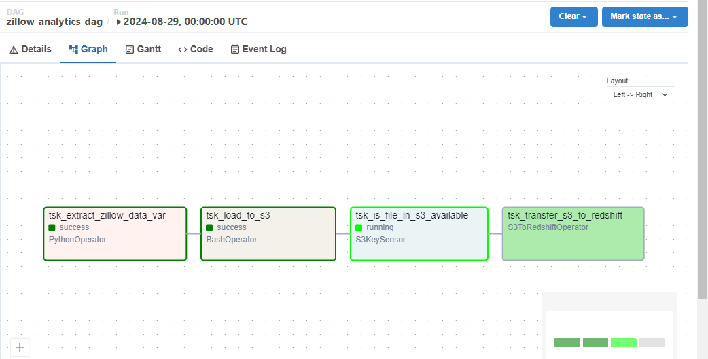
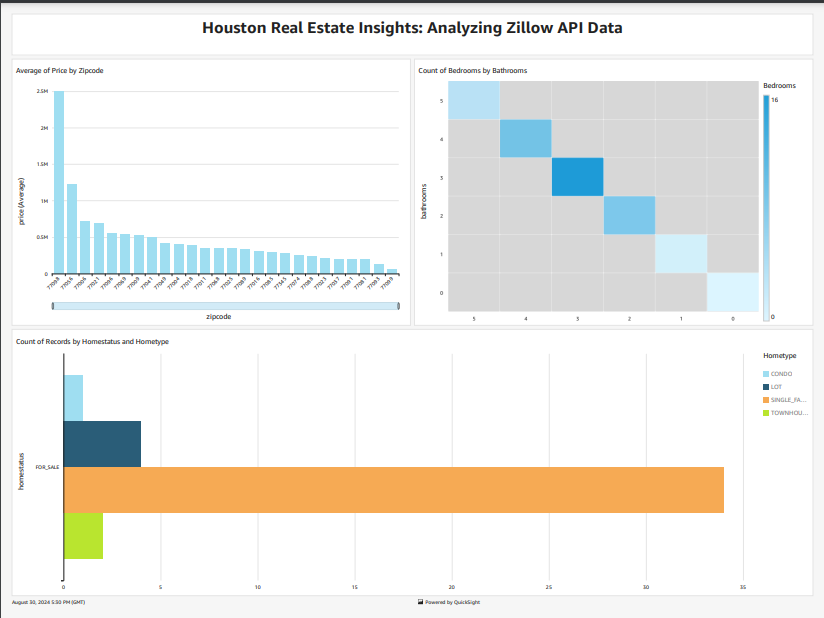

# Zillow Analytics Project

## Overview

The Zillow Analytics Project aims to extract, process, and analyze real estate data from Zillow to gain insights into the housing market in Houston. The data pipeline is managed using Apache Airflow, and the analysis is visualized with Amazon QuickSight.

## Project Structure

### Database Schema

The `zillowdata` table is created as follows:

```sql
CREATE TABLE IF NOT EXISTS zillowdata (
    bathrooms NUMERIC,
    bedrooms NUMERIC,
    city VARCHAR(255),
    homeStatus VARCHAR(50),
    homeType VARCHAR(50),
    livingArea NUMERIC,
    price NUMERIC,
    rentZestimate NUMERIC,
    zipcode INT
);
```

### Airflow DAG

The Airflow DAG (`zillow_analytics_dag`) orchestrates the data pipeline:

1. **Extract Zillow Data**: Uses a `PythonOperator` to extract data from Zillow.
2. **Load to S3**: A `BashOperator` uploads the extracted data to Amazon S3.
3. **Check S3 File Availability**: An `S3KeySensor` checks for the file in S3.
4. **Transfer from S3 to Redshift**: Uses an `S3ToRedshiftOperator` to load data into Amazon Redshift.


*Airflow DAG showing the workflow of the data pipeline.*

### Data Visualization

Using Amazon QuickSight, the following insights are visualized:

- **Average Price by Zipcode**: A bar chart showing the average price of properties across different zip codes.
- **Count of Bedrooms by Bathrooms**: A heatmap displaying distributions of bedroom and bathroom counts.
- **Count of Records by Home Status and Home Type**: A bar chart illustrating the number of records for different home statuses and types.


*Dashboard visualizing real estate data insights.*

## Getting Started

### Prerequisites

- Apache Airflow
- Amazon S3
- Amazon Redshift
- Amazon QuickSight
- **RapidAPI Account**: A RapidAPI account is required to access the Zillow API. You will need an API key to retrieve data.

### Setup

1. **Clone the Repository:**
   ```bash
   git clone https://github.com/aouadayoub/Zillow-ETL-AWS.git
   ```

2. **Set Up Airflow:**
   - Configure Airflow connections for AWS and Redshift.
   - Load the DAG file into your Airflow environment.

3. **Configure AWS Services:**
   - Ensure S3 buckets and Redshift clusters are properly set up.
   - Connect QuickSight to the Redshift database for visualization.

4. **Run the DAG:**
   - Trigger the DAG in Airflow to start the data pipeline.


