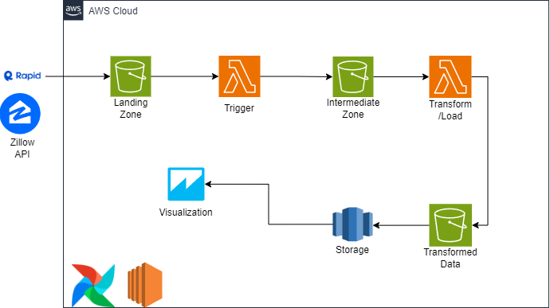
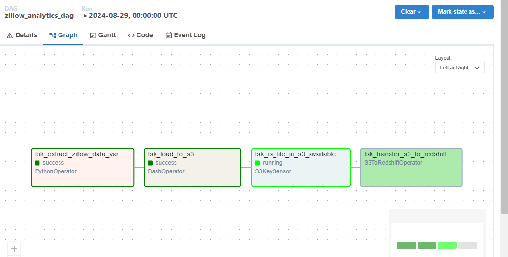
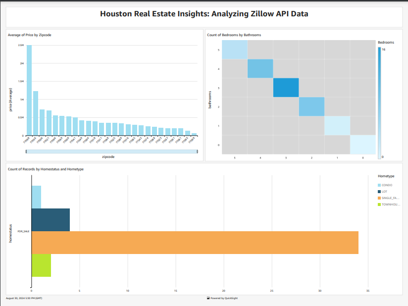

# Zillow Analytics Project

## Overview

The Zillow Analytics Project is designed to extract, process, and analyze real estate data from Zillow, focusing on insights into the housing market in Houston. The data pipeline is managed using Apache Airflow, and the analysis is visualized with Amazon QuickSight.

## Project Structure

### AWS Architecture

The Zillow Analytics Project utilizes a robust AWS architecture to manage the data pipeline and provide insights:

- **Zillow API**: Extracts real estate data.
- **Apache Airflow**: Orchestrates the ETL pipeline, including data extraction, loading, and transformation.
- **Amazon S3**: Temporarily stores raw data before processing.
- **Amazon Redshift**: Serves as the data warehouse for storing and analyzing processed data.
- **Amazon QuickSight**: Provides visualization capabilities to generate insights and dashboards based on the processed data.

The diagram below illustrates the workflow and interactions between these components:



Workflow:
1. Data is extracted from the Zillow API.
2. Apache Airflow manages the ETL process and uploads data to Amazon S3.
3. Data availability in S3 is monitored before transferring to Amazon Redshift.
4. Data in Redshift is visualized using Amazon QuickSight to generate insights.

### Database Schema

The `zillowdata` table is defined as follows:

```sql
CREATE TABLE IF NOT EXISTS zillowdata (
    bathrooms NUMERIC,
    bedrooms NUMERIC,
    city VARCHAR(255),
    homeStatus VARCHAR(50),
    homeType VARCHAR(50),
    livingArea NUMERIC,
    price NUMERIC,
    rentZestimate NUMERIC,
    zipcode INT
);
```

### Airflow DAG

The Airflow DAG (`zillow_analytics_dag`) manages the data pipeline as follows:

1. **Extract Zillow Data**: Uses a `PythonOperator` to extract data from Zillow.
2. **Load to S3**: A `BashOperator` uploads the extracted data to Amazon S3.
3. **Check S3 File Availability**: An `S3KeySensor` monitors the file's availability in S3.
4. **Transfer from S3 to Redshift**: Uses an `S3ToRedshiftOperator` to load data into Amazon Redshift.


*Airflow DAG showing the data pipeline workflow.*

### Data Visualization

Amazon QuickSight is used to visualize the following insights:

- **Average Price by Zipcode**: Bar chart displaying the average property price across different zip codes.
- **Count of Bedrooms by Bathrooms**: Heatmap showing the distribution of bedroom and bathroom counts.
- **Count of Records by Home Status and Home Type**: Bar chart illustrating the number of records for various home statuses and types.


*Dashboard visualizing real estate data insights.*

## Getting Started

### Prerequisites

- Apache Airflow
- Amazon S3
- Amazon Redshift
- Amazon QuickSight
- **RapidAPI Account**: Required to access the Zillow API. Obtain an API key to retrieve data.

### Setup

1. **Clone the Repository:**
   ```bash
   git clone https://github.com/aouadayoub/Zillow-ETL-AWS.git
   ```

2. **Set Up Airflow:**
   - Configure Airflow connections for AWS and Redshift.
   - Load the DAG file into your Airflow environment.

3. **Configure AWS Services:**
   - Set up S3 buckets and Redshift clusters.
   - Connect QuickSight to the Redshift database for visualization.

4. **Run the DAG:**
   - Trigger the DAG in Airflow to initiate the data pipeline.
